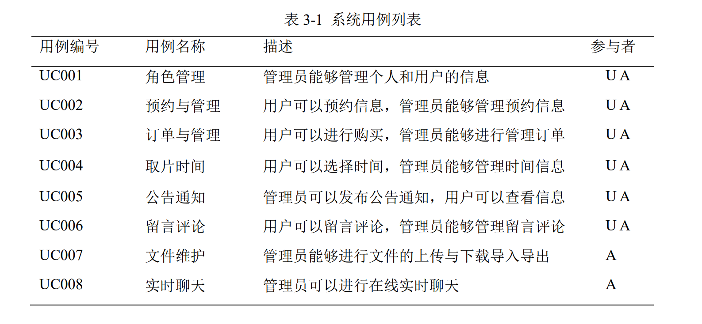
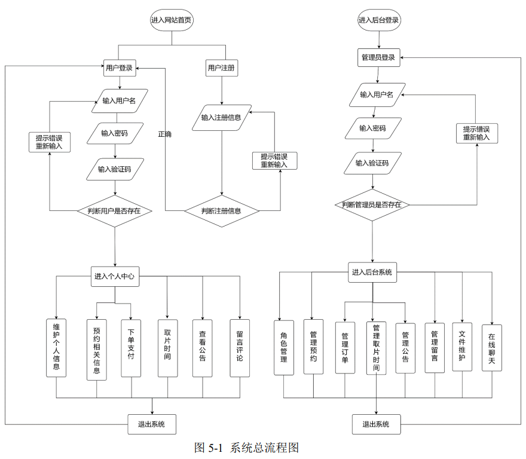

# 基于SpringBoot的摄影网站的实现

前后端分离项目

## 技术应用

::: info 技术应用
 前端：vue3 + elementplus + BootStrap + axios + WebSocket  

 后端：SpringBoot + MyBaitsPlus + JWT  

 数据库：MySql  

 环境：JDK1.8  
:::

## 工具使用

::: tip 工具使用
 &emsp;&emsp;&emsp;&emsp;● VScode  
 &emsp;&emsp;&emsp;&emsp;● Navicat  
 &emsp;&emsp;&emsp;&emsp;● Postman  
 &emsp;&emsp;&emsp;&emsp;● natapp  
 &emsp;&emsp;&emsp;&emsp;● 支付宝云平台  
:::

## 实现功能

 

 

## 项目概览

::: danger  游客部分
游客部分，只能对网站进行浏览，不能进行任何的操作，除非注册账号后登录
:::  

 

::: info  个人中心
用户个人中心部分，输入用户名密码登录后，能够进行如下操作： 
●  能够管理个人信息，包括修改和上传头像，头像会实时更新。  
●  能够查看后台的摄影师、服装等信息，但是只能预约（新增信息），不能修改。  
●  能够预约取片时间，除此之外还能够进行Todolist备忘操作。  
●  能够模拟使用支付宝进行购买操作。  
●  能够实现留言与评论，但是只能实现二级评论。  
:::

 

::: tip 后台管理
管理员后台管理部分，输入用户名密码登录后，能够进行如下操作： 
●  能够实现数据可视化，首页使用Echar实现数据可视化  
●  能够实现JWT登录，是网站信息更为安全  
●  能够管理个人信息，包括修改和上传头像，头像会实时更新。除此之外还能维护用户的相关信息  
●  能够进行最基本的新增、修改、删除、查询功能，还能进行批量删除操作  
●  能够实现文件的上传、下载以及导入、导出操作  
●  能够实现富文本的编辑修改，主要是使用的WangEditor编辑插件  
●  能够实现在线聊天功能，只能群组聊天不能单人对单人聊天。主要是用Node做服务器，使用websocket进行通信  
:::

 

## 项目笔记

[wyt的项目笔记详细制作过程](https://www.yuque.com/gumeng-zkdjs/gr69f5 "wyt项目笔记详细制作过程")。
