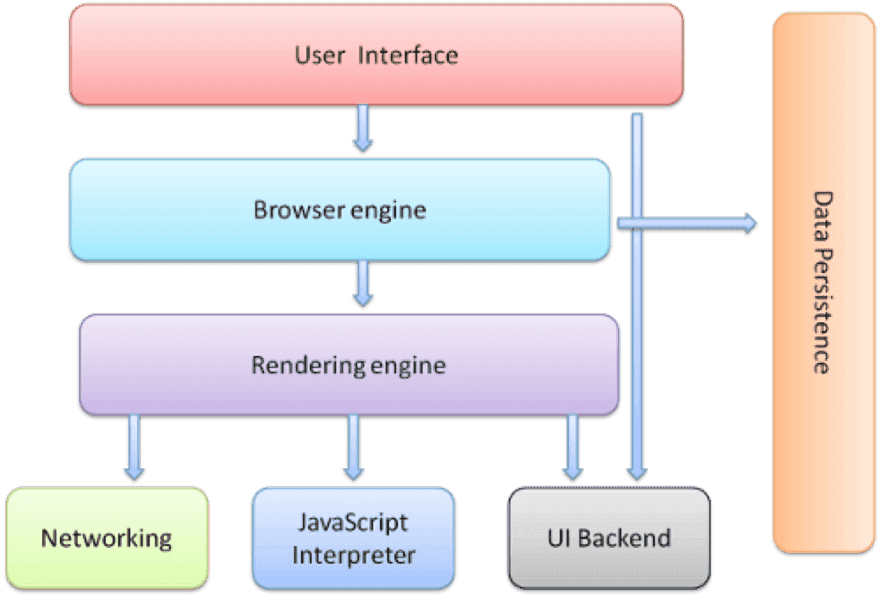
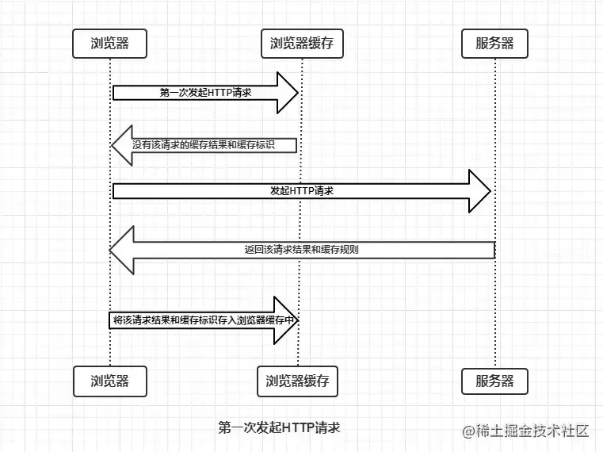
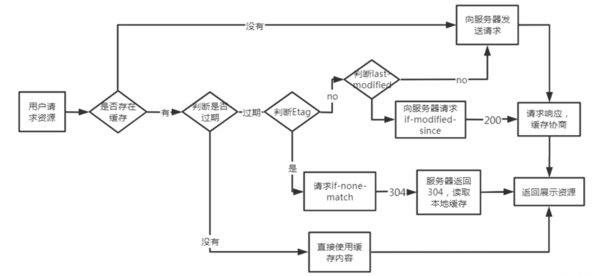

# 浏览器
[[Toc]]
## 从输入URL到页面加载的全过程

::: danger 参考
1. 首先在浏览器中**输入URL**
2. **查找缓存**：浏览器先查看浏览器缓存-系统缓存-路由缓存中是否有该地址页面，如果有则显示页面内容。如果没有则进行下一步。
  ○ 浏览器缓存：浏览器会记录DNS一段时间，因此，只是第一个地方解析DNS请求；
  ○ 操作系统缓存:如果在浏览器缓存中不包含这个记录，则会使系统调用操作系统， 获取操作系统的记录(保存最近的DNS查询缓存)；
  ○ 路由器缓存：如果上述两个步骤均不能成功获取DNS记录，继续搜索路由器缓存；
  ○ ISP缓存：若上述均失败，继续向ISP搜索。
3. **DNS域名解析**：浏览器向DNS服务器发起请求，解析该URL中的域名对应的IP地址。DNS服务器是基于UDP的，因此会用到UDP协议。
4. **建立TCP连接**：解析出IP地址后，根据IP地址和默认80端口，和服务器建立TCP连接
5. **发起HTTP请求**：浏览器发起读取文件的HTTP请求，，该请求报文作为TCP三次握手的第三次数据发送给服务器
6. **服务器响应请求并返回结果**：服务器对浏览器请求做出响应，并把对应的html文件发送给浏览器
7. **关闭TCP连接**：通过四次挥手释放TCP连接
8. **浏览器渲染**：客户端（浏览器）解析HTML内容并渲染出来，浏览器接收到数据包后的解析流程为：
  ○ 构建DOM树：词法分析然后解析成DOM树（dom tree），是由dom元素及属性节点组成，树的根是document对象
  ○ 构建CSS规则树：生成CSS规则树（CSS Rule Tree）
  ○ 构建render树：Web浏览器将DOM和CSSOM结合，并构建出渲染树（render tree）
  ○ 布局（Layout）：计算出每个节点在屏幕中的位置
  ○ 绘制（Painting）：即遍历render树，并使用UI后端层绘制每个节点。
9. **JS引擎解析过程**：调用JS引擎执行JS代码（JS的解释阶段，预处理阶段，执行阶段生成执行上下文，VO，作用域链、回收机制等等）
  ○ 创建window对象：window对象也叫全局执行环境，当页面产生时就被创建，所有的全局变量和函数都属于window的属性和方法，而DOM Tree也会映射在window的doucment对象上。当关闭网页或者关闭浏览器时，全局执行环境会被销毁。
  ○ 加载文件：完成js引擎分析它的语法与词法是否合法，如果合法进入预编译
  ○ 预编译：在预编译的过程中，浏览器会寻找全局变量声明，把它作为window的属性加入到window对象中，并给变量赋值为'undefined'；寻找全局函数声明，把它作为window的方法加入到window对象中，并将函数体赋值给他（匿名函数是不参与预编译的，因为它是变量）。而变量提升作为不合理的地方在ES6中已经解决了，函数提升还存在。
  ○ 解释执行：执行到变量就赋值，如果变量没有被定义，也就没有被预编译直接赋值，在ES5非严格模式下这个变量会成为window的一个属性，也就是成为全局变量。string、int这样的值就是直接把值放在变量的存储空间里，object对象就是把指针指向变量的存储空间。函数执行，就将函数的环境推入一个环境的栈中，执行完成后再弹出，控制权交还给之前的环境。JS作用域其实就是这样的执行流机制实现的。
:::
## 在浏览器中输入URL到显示页面经历哪些过程，涉及到哪些协议？
::: info 参考
&emsp;&emsp;浏览器要将URL解析为IP地址，解析域名就要用到DNS协议，首先主机会查询DNS的缓存，如果没有就给本地DNS发送查询请求。DNS查询分为两种方式，一种是递归查询，一种是迭代查询。如果是迭代查询，本地的DNS服务器，向根域名服务器发送查询请求，根域名服务器告知该域名的一级域名服务器，然后本地服务器给该一级域名服务器发送查询请求，然后依次类推直到查询到该域名的IP地址。DNS服务器是基于UDP的，因此会用到UDP协议。 
&emsp;&emsp;得到IP地址后，浏览器就要与服务器建立一个http连接。因此要用到http协议。http生成一个get请求报文，将该报文传给TCP层处理，所以还会用到TCP协议。如果采用https还会使用https协议先对http数据进行加密。TCP层如果有需要先将HTTP数据包分片，分片依据路径MTU和MSS。TCP的数据包然后会发送给IP层，用到IP协议。IP层通过路由选路，一跳一跳发送到目的地址。当然在一个网段内的寻址是通过以太网协议实现(也可以是其他物理层协议，比如PPP，SLIP)，以太网协议需要直到目的IP地址的物理地址，有需要ARP协议。 
:::

**1、DNS协议，http协议，https协议属于应用层** 
&emsp;&emsp;应用层是体系结构中的最高层。应用层确定进程之间通信的性质以满足用户的需要。这里的进程就是指正在运行的程序。应用层不仅要提供应用进程所需要的信息交换和远地操作，而且还要作为互相作用的应用进程的用户代理，来完成一些为进行语义上有意义的信息交换所必须的功能。应用层直接为用户的应用进程提供服务。 

**2、TCP/UDP属于传输层** 
&emsp;&emsp;传输层的任务就是负责主机中两个进程之间的通信。因特网的传输层可使用两种不同协议：即面向连接的传输控制协议TCP，和无连接的用户数据报协议UDP。面向连接的服务能够提供可靠的交付，但无连接服务则不保证提供可靠的交付，它只是“尽最大努力交付”。这两种服务方式都很有用，备有其优缺点。在分组交换网内的各个交换结点机都没有传输层。 

**3、IP协议，ARP协议属于网络层** 
&emsp;&emsp;网络层负责为分组交换网上的不同主机提供通信。在发送数据时，网络层将运输层产生的报文段或用户数据报封装成分组或包进行传送。在TCP/IP体系中，分组也叫作IP数据报，或简称为数据报。网络层的另一个任务就是要选择合适的路由，使源主机运输层所传下来的分组能够交付到目的主机。 

**4、数据链路层** 
&emsp;&emsp;当发送数据时，数据链路层的任务是将在网络层交下来的IP数据报组装成帧，在两个相邻结点间的链路上传送以帧为单位的数据。每一帧包括数据和必要的控制信息（如同步信息、地址信息、差错控制、以及流量控制信息等）。控制信息使接收端能够知道—个帧从哪个比特开始和到哪个比特结束。控制信息还使接收端能够检测到所收到的帧中有无差错。 

**5、物理层** 
&emsp;&emsp;物理层的任务就是透明地传送比特流。在物理层上所传数据的单位是比特。传递信息所利用的一些物理媒体，如双绞线、同轴电缆、光缆等，并不在物理层之内而是在物理层的下面。因此也有人把物理媒体当做第0层。 

## 浏览器的主要功能

&emsp;&emsp;浏览器的主要功能就是**向服务器发出请求**，在浏览器窗口中展示您选择的网络资源。这里所说的资源一般是指 HTML 文档，也可以是 PDF、图片或其他的类型。资源的位置由用户使用 URI（统一资源标示符）指定。

## 浏览器的工作原理
&emsp;&emsp;**渲染引擎**将开始解析 HTML 文档，并将各标记逐个转化成“内容树”上的 DOM 节点。同时也会解析外部 CSS 文件以及样式元素中的样式数据。HTML 中这些带有视觉指令的样式信息将用于创建另一个树结构：渲染树。 
&emsp;&emsp;**渲染树**包含多个带有视觉属性（如颜色和尺寸）的矩形。这些矩形的排列顺序就是它们将在屏幕上显示的顺序。 
&emsp;&emsp;渲染树构建完毕之后，进入“**布局**”处理阶段，也就是为每个节点分配一个应出现在屏幕上的确切坐标。下一个阶段是**绘制** - 渲染引擎会遍历渲染树，由用户界面后端层将每个节点绘制出来。
需要着重指出的是，这是一个渐进的过程。为达到更好的用户体验，渲染引擎会力求尽快将内容显示在屏幕上。它不必等到整个 HTML 文档解析完毕之后，就会开始构建呈现树和设置布局。在不断接收和处理来自网络的其余内容的同时，渲染引擎会将部分内容解析并显示出来。 

## 浏览器的主要组成部分是什么？
 

1. **用户界面** - 包括地址栏、前进/后退按钮、书签菜单等。除了浏览器主窗口显示的您请求的页面外，其他显示的各个部分都属于用户界面。
2. **浏览器引擎** - 在用户界面和呈现引擎之间传送指令。
3. **呈现引擎** - 负责显示请求的内容。如果请求的内容是 HTML，它就负责解析 HTML 和 CSS 内容，并将解析后的内容显示在屏幕上。
4. **网络** - 用于网络调用，比如 HTTP 请求。其接口与平台无关，并为所有平台提供底层实现。
5. 用户界面后端 - 用于绘制基本的窗口小部件，比如组合框和窗口。其公开了与平台无关的通用接口，而在底层使用操作系统的用户界面方法。
6. **JavaScript 解释器**。用于解析和执行 JavaScript 代码。
7. **数据存储**。这是持久层。浏览器需要在硬盘上保存各种数据，例如 Cookie。新的 HTML 规范 (HTML5) 定义了“网络数据库”，这是一个完整（但是轻便）的浏览器内数据库。

## 浏览器是如何渲染UI的？
::: warning 参考
1. 浏览器获取HTML文件，然后对文件进行解析，形成DOM Tree
2. 与此同时，进行CSS解析，生成Style Rules
3. 接着将DOM Tree与Style Rules合成为 Render Tree
4. 接着进入布局（Layout）阶段，也就是为每个节点分配一个应出现在屏幕上的确切坐标
5. 随后调用GPU进行绘制（Paint），遍历Render Tree的节点，并将元素呈现出来
:::

## DOM Tree是如何构建的？
::: tip 参考
1. 转码: 浏览器将接收到的二进制数据按照指定编码格式转化为HTML字符串
2. 生成Tokens: 之后开始parser，浏览器会将HTML字符串解析成Tokens
3. 构建Nodes: 对Node添加特定的属性，通过指针确定 Node 的父、子、兄弟关系和所属 treeScope
4. 生成DOM Tree: 通过node包含的指针确定的关系构建出DOM\Tree
:::

## 浏览器重绘与重排的区别？
::: danger 参考
● 重排/回流（Reflow）：当DOM的变化影响了元素的几何信息，浏览器需要重新计算元素的几何属性，将其安放在界面中的正确位置，这个过程叫做重排。表现为重新生成布局，重新排列元素。 
● 重绘(Repaint): 当一个元素的外观发生改变，但没有改变布局,重新把元素外观绘制出来的过程，叫做重绘。表现为某些元素的外观被改变。 
&emsp;&emsp;单单改变元素的外观，肯定不会引起网页重新生成布局，但当浏览器完成重排之后，将会重新绘制受到此次重排影响的部分。 
&emsp;&emsp;重排和重绘代价是高昂的，它们会破坏用户体验，并且让UI展示非常迟缓，而相比之下重排的性能影响更大，在两者无法避免的情况下，一般我们宁可选择代价更小的重绘。 
『重绘』不一定会出现『重排』，『重排』必然会出现『重绘』。
:::

## 如何触发重排和重绘？
::: info 参考
任何改变用来构建渲染树的信息都会导致一次重排或重绘：
● 添加、删除、更新DOM节点
● 通过display: none隐藏一个DOM节点-触发重排和重绘
● 通过visibility: hidden隐藏一个DOM节点-只触发重绘，因为没有几何变化
● 移动或者给页面中的DOM节点添加动画
● 添加一个样式表，调整样式属性
● 用户行为，例如调整窗口大小，改变字号，或者滚动。
:::

## 如何避免重绘或者重排？
::: warning 参考
1. 集中改变样式，不要一条一条地修改 DOM 的样式。
2. 不要把 DOM 结点的属性值放在循环里当成循环里的变量。
3. 为动画的 HTML 元件使用 fixed 或 absoult 的 position，那么修改他们的 CSS 是不会 reflow 的。
4. 不使用 table 布局。因为可能很小的一个小改动会造成整个 table 的重新布局。
5. 尽量只修改position：absolute或fixed元素，对其他元素影响不大
6. 动画开始GPU加速，translate使用3D变化
7. 提升为合成层将元素提升为合成层有以下优点：提升合成层的最好方式是使用 CSS 的 will-change 属性：
  ○ 合成层的位图，会交由 GPU 合成，比 CPU 处理要快
  ○ 当需要 repaint 时，只需要 repaint 本身，不会影响到其他的层
  ○ 对于 transform 和 opacity 效果，不会触发 layout 和 paint
:::

## 浏览器的缓存机制：强制缓存；协商缓存
&emsp;&emsp;浏览器与服务器通信的方式为**应答模式**，即是：浏览器发起HTTP请求 – 服务器响应该请求。那么浏览器第一次向服务器发起该请求后拿到请求结果，会根据响应报文中HTTP头的缓存标识，决定是否缓存结果，是则将请求结果和缓存标识存入浏览器缓存中，简单的过程如下图： 

由上图我们可以知道： 
::: note  参考
● 浏览器每次发起请求，都会先在浏览器缓存中查找该请求的结果以及缓存标识 
● 浏览器每次拿到返回的请求结果都会将该结果和缓存标识存入浏览器缓存中 
:::
&emsp;&emsp;以上两点结论就是浏览器缓存机制的关键，他确保了每个请求的缓存存入与读取，只要我们再理解浏览器缓存的使用规则，那么所有的问题就迎刃而解了。为了方便理解，这里根据是否需要向服务器重新发起HTTP请求将缓存过程分为两个部分，分别是强制缓存和协商缓存。 
::: note  参考
● **强制缓存**就是向浏览器缓存查找该请求结果，并根据该结果的缓存规则来决定是否使用该缓存结果的过程。当浏览器向服务器发起请求时，服务器会将缓存规则放入HTTP响应报文的HTTP头中和请求结果一起返回给浏览器，控制强制缓存的字段分别是 Expires 和 Cache-Control，其中Cache-Control优先级比Expires高。 
:::
强制缓存的情况主要有三种(暂不分析协商缓存过程)，如下： 
  a. 不存在该缓存结果和缓存标识，强制缓存失效，则直接向服务器发起请求（跟第一次发起请求一致）。 
  b. 存在该缓存结果和缓存标识，但该结果已失效，强制缓存失效，则使用协商缓存。 
  c. 存在该缓存结果和缓存标识，且该结果尚未失效，强制缓存生效，直接返回该结果 
::: note  参考
● **协商缓存**就是强制缓存失效后，浏览器携带缓存标识向服务器发起请求，由服务器根据缓存标识决定是否使用缓存的过程，同样，协商缓存的标识也是在响应报文的HTTP头中和请求结果一起返回给浏览器的，控制协商缓存的字段分别有：Last-Modified / If-Modified-Since 和 Etag / If-None-Match，其中Etag / If-None-Match的优先级比Last-Modified / If-Modified-Since高。协商缓存主要有以下两种情况： 
:::
  a. 协商缓存生效，返回304 
  b. 协商缓存失效，返回200和请求结果结果 

## Cookie、sessionStorage、localStorage 的区别
::: info 相同点
Cookie、SessionStorage、 LocalStorage都是浏览器的本地存储。  
:::
::: warning  不同点
● cookie是由服务器端写入的，而SessionStorage、 LocalStorage都是由前端写入的 
● cookie设置的过期时间之前一直有效；localStorage永久存储，浏览器关闭后数据不丢失除非主动删除数据；sessionStorage数据在当前浏览器窗口关闭后自动删除 
● cookie数据大小不能超过4k；sessionStorage和localStorage的存储比cookie大得多，可以达到5M+ 
● Cookie、SessionStorage、 LocalStorage数据共享都遵循同源原则，SessionStorage还限制必须是同一个页面。在前端给后端发送请求的时候会自动携带Cookie中的数据，但是SessionStorage、 LocalStorage不会  
● cookie的数据会自动的传递到服务器；sessionStorage和localStorage数据保存在本地 
:::
::: danger 加分回答
&emsp;&emsp;由于它们的以上区别，所以它们的应用场景也不同，Cookie一般用于存储登录验证信息SessionID或者token，LocalStorage常用于存储不易变动的数据，减轻服务器的压力，SessionStorage可以用来检测用户是否是刷新进入页面，如音乐播放器恢复播放进度条的功能。 
:::

## 说下进程、线程和协程
::: tip 概念
&emsp;&emsp;**进程**是一个具有一定独立功能的程序在一个数据集上的一次动态执行的过程，是操作系统进行资源分配和调度的一个独立单位，是应用程序运行的载体。进程是一种抽象的概念，从来没有统一的标准定义。 
&emsp;&emsp;**线程**是程序执行中一个单一的顺序控制流程，是程序执行流的最小单元，是处理器调度和分派的基本单位。一个进程可以有一个或多个线程，各个线程之间共享程序的内存空间(也就是所在进程的内存空间)。一个标准的线程由线程ID、当前指令指针(PC)、寄存器和堆栈组成。而进程由内存空间(代码、数据、进程空间、打开的文件)和一个或多个线程组成。 
&emsp;&emsp;**协程**，英文Coroutines，是一种基于线程之上，但又比线程更加轻量级的存在，这种由程序员自己写程序来管理的轻量级线程叫做『用户空间线程』，具有对内核来说不可见的特性。 
:::

::: warning 区别
● 调度：线程作为调度和分配的基本单位，进程作为拥有资源的基本单位； 
● 并发性：不仅进程之间可以并发执行，同一个进程的多个线程之间也可并发执行； 
● 拥有资源：进程是拥有资源的一个独立单位，线程不拥有系统资源，但可以访问隶属于进程的资源。 
● 系统开销：在创建或撤消进程时，由于系统都要为之分配和回收资源，导致系统的开销明显大于创建或撤消线程时的开销。但是进程有独立的地址空间，一个进程崩溃后，在保护模式下不会对其它进程产生影响，而线程只是一个进程中的不同执行路径。线程有自己的堆栈和局部变量，但线程之间没有单独的地址空间，一个进程死掉就等于所有的线程死掉，所以多进程的程序要比多线程的程序健壮，但在进程切换时，耗费资源较大，效率要差一些。 
:::
::: info 联系
一个线程只能属于一个进程，而一个进程可以有多个线程，但至少有一个线程； 
资源分配给进程，同一进程的所有线程共享该进程的所有资源； 
处理机分给线程，即真正在处理机上运行的是线程； 
线程在执行过程中，需要协作同步。不同进程的线程间要利用消息通信的办法实现同步。 
:::

## 进程间的通信方式
&emsp;&emsp;**进程通信**：每个进程各自有不同的用户地址空间,任何一个进程的全局变量在另一个进程中都看不到，所以进程之间要交换数据必须通过内核,在内核中开辟一块缓冲区,进程A把数据从用户空间拷到内核缓冲区,进程B再从内核缓冲区把数据读走,内核提供的这种机制称为进程间通信。 
&emsp;&emsp;**进程间的通信方式**：管道、有名管道、信号、消息队列、共享内存、信号量、socket 
&emsp;&emsp;**匿名管道( pipe )**： 管道是一种半双工的通信方式，数据只能单向流动，而且只能在具有亲缘关系的进程间使用。进程的亲缘关系通常是指父子进程关系。 
&emsp;&emsp;**高级管道(popen)**：将另一个程序当做一个新的进程在当前程序进程中启动，则它算是当前程序的子进程，这种方式我们成为高级管道方式。 
&emsp;&emsp;**有名管道 (named pipe)**： 有名管道也是半双工的通信方式，但是它允许无亲缘关系进程间的通信。 
&emsp;&emsp;**消息队列( message queue )** ： 消息队列是由消息的链表，存放在内核中并由消息队列标识符标识。消息队列克服了信号传递信息少、管道只能承载无格式字节流以及缓冲区大小受限等缺点。 
&emsp;&emsp;**信号量( semophore )** ： 信号量是一个计数器，可以用来控制多个进程对共享资源的访问。它常作为一种锁机制，防止某进程正在访问共享资源时，其他进程也访问该资源。因此，主要作为进程间以及同一进程内不同线程之间的同步手段。 
&emsp;&emsp;**信号 ( sinal )** ： 信号是一种比较复杂的通信方式，用于通知接收进程某个事件已经发生。 
&emsp;&emsp;**共享内存( shared memory )**：共享内存就是映射一段能被其他进程所访问的内存，这段共享内存由一个进程创建，但多个进程都可以访问。共享内存是最快的 IPC 方式，它是针对其他进程间通信方式运行效率低而专门设计的。它往往与其他通信机制，如信号两，配合使用，来实现进程间的同步和通信。 
&emsp;&emsp;**套接字( socket ) 通信**： 套接口也是一种进程间通信机制，与其他通信机制不同的是，它可用于不同机器间的进程通信 

## 浏览器样式兼容
::: tip CSS初始化
每个浏览器的css默认样式不尽相同，所以最简单有效的方式就是对其进行初始化（覆盖默认样式）
常见 :  *{ margin: 0; padding: 0;}
库：normalize.css

::: 

::: info 浏览器私有属性
firefox浏览器 ：-moz-
chrome、safari ：-webkit-
opera ：-o- / -xv-
IE浏览器 ：-ms-（目前只有 IE 8+支持）
::: 

::: danger 常用的前缀有
CSS hack（条件hack、属性级hack、选择符级hack）
:::

## 浏览器的同源策略==》跨域问题
::: warning 同源策略
&emsp;&emsp;同源策略是一个重要的安全策略，它用于限制同一个 origin 的文档或者它加载的脚本如何能与另一个源的资源进行交互，它能帮助阻隔恶意文档，减少可能被攻击的媒介。 
:::
源的组合： 
● **协议**（http、https） 
● **域**（myapp.com、localhost、localhost.tiangolo.com） 
● **端口**（80、443、8080） 
同源：协议、域、端口都是相同的就是同源，其中有一个不同则为不同源。（不同源会导致跨域问题） 
举个栗子 
| URL         | 结果        |     原因           |
| :---        |    :----:   |   :----: |
| http://store.company.com/dir2/other.html | 同源 | 只有路径不同|
| http://store.company.com/dir/inner/another.html  | 同源|只有路径不同|
| https://store.company.com/secure.html |失败|协议不同|
|http://store.company.com:81/dir/etc.html|失败|端口不同|
|http://news.company.com/dir/other.html|失败|主机不同|

>ps：127.0.0.1:8080与localhost：8080 是不同源的。  

两种同源策略
::: tabs#两种同源策略 

@tab DOM 同源策略

禁止对不同源页面 DOM 进行操作。这里主要场景是 iframe 跨域的情况，不同域名的 iframe 是限制互相访问的。

@tab XMLHttpRequest 同源策略

禁止使用 XHR 对象向不同源的服务器地址发起 HTTP 请求。

:::
为什么要有同源策略（跨域限制） 

如果没有 DOM 同源策略，不同域的 iframe 之间可以相互访问，那么黑客可以这样进行攻击： 
1. 做一个假网站，里面用 iframe 嵌套一个银行网站 http://mybank.com 
2. 把 iframe 覆盖到整个页面，这样用户进来除了域名，别的部分和银行的网站没有任何差别。 
3. 这时如果用户输入账号密码，我们的主网站可以跨域访问到 http://mybank.com 的 dom 节点，就可以拿到用户的账户密码了

如果没有 XMLHttpRequest 同源策略 
那么黑客可以进行 CSRF（跨站请求伪造） 攻击： 
1. 用户登录了自己的银行页面 http://mybank.com，http://mybank.com 向用户的 cookie 中添加用户标识 
2. 用户浏览了恶意页面 http://evil.com，执行了页面中的恶意 AJAX 请求代码 
3. http://evil.com 向 http://mybank.com 发起 AJAX HTTP 请求，请求会默认把 http://mybank.com 对应 cookie 也同时发送过去 
4. 银行页面从发送的 cookie 中提取用户标识，验证用户无误，response 中返回请求数据，此时数据就泄露了 
而且由于 Ajax 在后台执行，用户无法感知这一过程 

总结： 
● 同源策略确实能规避一些危险，不是说有了同源策略就安全，只是说同源策略是一种浏览器最基本的安全机制
● 能提高一点攻击的成本
