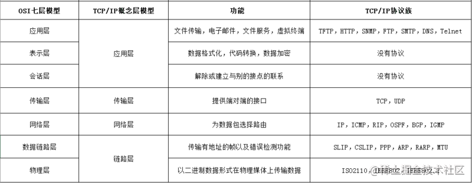
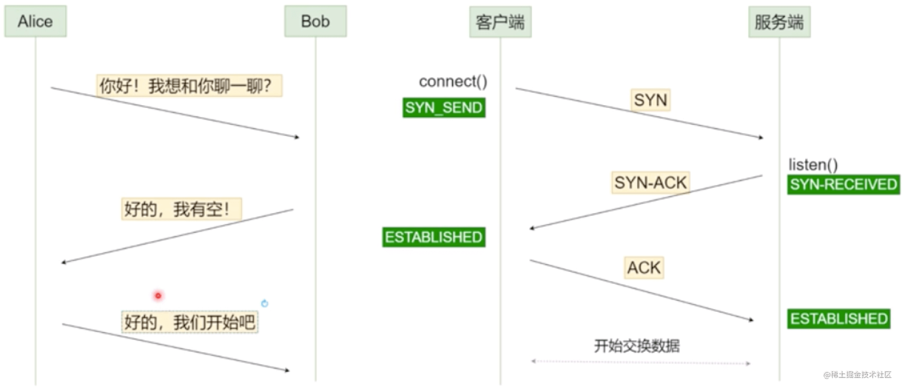

# 计算机网络
## Http

::: tip HTTP基本概念
&emsp;&emsp;http: 是互联网上应用最为广泛的一种网络协议，是一个客户端和服务器端请求和应答的标准（TCP），用于从 WWW 服务器传输超文本到本地浏览器的超文本传输协议。
:::

::: warning HTTP工作原理
&emsp;&emsp;HTTP协议定义Web客户端如何从Web服务器请求Web页面，以及服务器如何把Web页面传送给客户端。客户端向服务器发送一个请求报文，服务器以一个状态行作为响应。
:::

::: danger HTTP请求/响应的步骤
● 1.客户端连接到Web服务器<br>
● 2.发送HTTP请求<br>
● 3.服务器接受请求并返回HTTP响应<br>
● 4.释放TCP连接<br>
● 5.客户端（浏览器）解析HTML内容<br>
:::

::: info HTTP 的 5 种方法
● GET---获取资源<br>
● POST---传输资源<br>
● PUT---更新资源<br>
● DELETE---删除资源<br>
● HEAD---获取报文首部<br>
:::
### GET与POST的区别
1.浏览器**回退表现不同** GET在浏览器回退时是无害的，而POST会再次提交请求<br>
2.浏览器对**请求地址的处理不同** GET请求地址会被浏览器主动缓存，而POST不会，除非手动设置<br>
3.浏览器对**响应的处理不同**GET请求参数会被完整的保留在浏览器历史记录里，而POST中的参数不会被保留<br>
4.**参数大小不同**. GET请求在URL中传送的参数是有长度的限制，而POST没有限制<br>
5.**安全性不同**. GET参数通过URL传递，会暴露，不安全；POST放在Request Body中，相对更安全<br>
6.针对**数据操作的类型不同**.GET对数据进行查询，POST主要对数据进行增删改！简单说，GET是只读，POST是写。<br>
### HTTP报文的组成成分

::: danger Request Header:

```http
GET: /sample.Jsp HTTP/1.1  //请求行
Host:  www.uuid.online/ //请求的目标域名和端口号
Origin: http://localhost:8081/  //请求的来源域名和端口号 （跨域请求时，浏览器会自动带上这个头信息）
Referer: https://localhost:8081/link?query=xxxxx //请求资源的完整URI
User-Agent: Mozilla/5.0 (Windows NT 10.0; Win64; x64) AppleWebKit/537.36 (KHTML, like Gecko) Chrome/67.0.3396.99 Safari/537.36 //浏览器信息
Cookie:  BAIDUID=FA89F036:FG=1; BD_HOME=1; sugstore=0  //当前域名下的Cookie
Accept: text/html,image/apng  //代表客户端希望接受的数据类型是html或者是png图片类型
Accept-Encoding: gzip, deflate  //代表客户端能支持gzip和deflate格式的压缩
Accept-Language: zh-CN,zh;q=0.9  //代表客户端可以支持语言zh-CN或者zh(值得一提的是q(0~1)是优先级权重的意思，不写默认为1，这里zh-CN是1，zh是0.9)
Connection: keep-alive  //告诉服务器，客户端需要的tcp连接是一个长连接
```
::: 
::: info Response Header:

```http
HTTP/1.1 200 OK  // 响应状态行
Date:  Mon, 30 Jul 2018 02:50:55 GMT  //服务端发送资源时的服务器时间
Expires:  Wed, 31 Dec 1969 23:59:59 GMT //比较过时的一种验证缓存的方式，与浏览器（客户端）的时间比较，超过这个时间就不用缓存（不和服务器进行验证），适合版本比较稳定的网页
Cache-Control:  no-cache  // 现在最多使用的控制缓存的方式，会和服务器进行缓存验证，具体见博文”Cache-Control“
etag:  "fb8ba2f80b1d324bb997cbe188f28187-ssl-df"  // 一般是Nginx静态服务器发来的静态文件签名，浏览在没有“Disabled cache”情况下，接收到etag后，同一个url第二次请求就会自动带上“If-None-Match”
Last-Modified:  Fri, 27 Jul 2018 11:04:55 GMT //是服务器发来的当前资源最后一次修改的时间，下次请求时，如果服务器上当前资源的修改时间大于这个时间，就返回新的资源内容
Content-Type:  text/html; charset=utf-8  //如果返回是流式的数据，我们就必须告诉浏览器这个头，不然浏览器会下载这个页面，同时告诉浏览器是utf8编码，否则可能出现乱码
Content-Encoding:  gzip  //告诉客户端，应该采用gzip对资源进行解码
Connection:  keep-alive  //告诉客户端服务器的tcp连接也是一个长连接
```
::: 

## Https
### Https的概念
https:是以安全为目标的 HTTP 通道，即 HTTP 下 加入 SSL 层进行加密。<br> 
https 协议的作用：建立一个信息安全通道，来确保数据的传输，确保网站的真实性。<br> 
### http 和 https 的区别？
● http 是超文本传输协议，信息是明文传输，https 则是具有安全性的 ssl 加密传输协议。<br> 
● Https 协议需要 ca 证书，费用较高。 <br> 
● 使用不同的链接方式，端口也不同，一般，http 协议的端口为 80，https 的端口为 443。<br> 
● http 的连接很简单，是无状态的。<br> 
> 记忆口诀：明文传输超文本，安全等级各不同。CA证书费用高，无状连接端难同。<br> 
### https 协议的工作原理
客户端在使用 HTTPS 方式与 Web 服务器通信时有以下几个步骤：<br> 
1. 客户端使用 https url 访问服务器，则要求 web 服务器建立 ssl 链接。<br> 
2. web 服务器接收到客户端的请求之后，会将网站的证书（证书中包含了公钥），传输给客户端。<br> 
3. 客户端和 web 服务器端开始协商 SSL 链接的安全等级，也就是加密等级。<br> 
4. 客户端浏览器通过双方协商一致的安全等级，建立会话密钥，然后通过网站的公钥来加密会话密钥，并传送给网站。<br> 
5. web 服务器通过自己的私钥解密出会话密钥。<br> 
6. web 服务器通过会话密钥加密与客户端之间的通信。<br> 
> 记忆口诀：一连二传三协商，四建五得六使用。
### https 协议的优缺点
● HTTPS 协议要比 http 协议**安全**，可防止数据在传输过程中被窃取、改变，确保数据的完整性。<br> 
● https 握手阶段比较**费时**，会使页面加载时间延长 50%，增加 10%~20%的耗电。 <br> 
● https **缓存**不如 http 高效，会增加数据开销。 <br> 
● SSL 证书也需要钱，功能越强大的证书**费用**越高。 <br> 
● SSL 证书需要**绑定 IP**，不能再同一个 ip 上绑定多个域名，ipv4 资源支持不了这种消耗。<br> 

## TCP/IP/UDP
TCP/IP模型是互联网的基础，它是一系列网络协议的总称。这些协议可以划分为四层，分别为链路层、网络层、传输层和应用层。<br>
● 链路层：负责封装和解封装IP报文，发送和接受ARP/RARP报文等。<br>
● 网络层：负责路由以及把分组报文发送给目标网络或主机。<br>
● 传输层：负责对报文进行分组和重组，并以TCP或UDP协议格式封装报文。<br>
● 应用层：负责向用户提供应用程序，比如HTTP、FTP、Telnet、DNS、SMTP等。<br>
<div style="align:center"></div>

### TCP三次握手
<div style="align:center"></div>

::: danger 第一次握手
建立连接时，客户端发送syn包（syn=j）到服务器，并进入SYN_SENT状态，等待服务器确认；SYN：同步序列编号（Synchronize Sequence Numbers）。
:::

::: danger 第二次握手
服务器收到syn包并确认客户的SYN（ack=j+1），同时也发送一个自己的SYN包（syn=k），即SYN+ACK包，此时服务器进入SYN_RECV状态；
:::

::: danger 第三次握手
客户端收到服务器的SYN+ACK包，向服务器发送确认包ACK(ack=k+1），此包发送完毕，客户端和服务器进入ESTABLISHED（TCP连接成功）状态，完成三次握手。
:::
> 握手过程中传送的包里不包含数据，三次握手完毕后，客户端与服务器才正式开始传送数据。

### TCP 四次挥手 
::: info 四次挥手 
1、客户端进程发出连接释放报文，并且停止发送数据。释放数据报文首部，FIN=1，其序列号为seq=u（等于前面已经传送过来的数据的最后一个字节的序号加1），此时，客户端进入FIN-WAIT-1（终止等待1）状态。 TCP规定，FIN报文段即使不携带数据，也要消耗一个序号。<br>
2、服务器收到连接释放报文，发出确认报文，ACK=1，ack=u+1，并且带上自己的序列号seq=v，此时，服务端就进入了CLOSE-WAIT（关闭等待）状态。TCP服务器通知高层的应用进程，客户端向服务器的方向就释放了，这时候处于半关闭状态，即客户端已经没有数据要发送了，但是服务器若发送数据，客户端依然要接受。这个状态还要持续一段时间，也就是整个CLOSE-WAIT状态持续的时间。<br>
3、客户端收到服务器的确认请求后，此时，客户端就进入FIN-WAIT-2（终止等待2）状态，等待服务器发送连接释放报文（在这之前还需要接受服务器发送的最 后的数据）。<br>
4、服务器将最后的数据发送完毕后，就向客户端发送连接释放报文，FIN=1，ack=u+1，由于在半关闭状态，服务器很可能又发送了一些数据，假定此时的序列号为seq=w，此时，服务器就进入了LAST-ACK（最后确认）状态，等待客户端的确认。<br>
5、客户端收到服务器的连接释放报文后，必须发出确认，ACK=1，ack=w+1，而自己的序列号是seq=u+1，此时，客户端就进入了TIME-WAIT（时间等待）状态。注意此时TCP连接还没有释放，必须经过2∗∗MSL（最长报文段寿命）的时间后，当客户端撤销相应的TCB后，才进入CLOSED状态。<br>
6、服务器只要收到了客户端发出的确认，立即进入CLOSED状态。同样，撤销TCB后，就结束了这次的TCP连接。可以看到，服务器结束TCP连接的时间要比客户端早一些。<br>

:::

### TCP和UDP的区别
1. TCP是面向连接的，而UDP是面向无连接的。<br>
2. TCP仅支持单播传输，UDP 提供了单播，多播，广播的功能。<br>
3. TCP的三次握手保证了连接的可靠性; UDP是无连接的、不可靠的一种数据传输协议，首先不可靠性体现在无连接上，通信都不需要建立连接，对接收到的数据也不发送确认信号，发送端不知道数据是否会正确接收。<br>
4. UDP的头部开销比TCP的更小，数据传输速率更高，实时性更好。<br>

## HTTP状态码及常见状态码
::: danger  状态码
● 1xx：指示信息类，表示请求已接受，继续处理<br>
● 2xx：指示成功类，表示请求已成功接受<br>
● 3xx：指示重定向，表示要完成请求必须进行更近一步的操作<br>
● 4xx：指示客户端错误，请求有语法错误或请求无法实现<br>
● 5xx：指示服务器错误，服务器未能实现合法的请求<br>
:::
::: warning  常见状态码
● 200 OK：客户端请求成功<br>
● 301 Moved Permanently：所请求的页面已经永久重定向至新的URL<br>
● 302 Found：所请求的页面已经临时重定向至新的URL<br>
● 304 Not Modified 未修改。<br>
● 403 Forbidden：对请求页面的访问被禁止<br>
● 404 Not Found：请求资源不存在<br>
● 500 Internal Server Error：服务器发生不可预期的错误原来缓冲的文档还可以继续使用<br>
● 503 Server Unavailable：请求未完成，服务器临时过载或宕机，一段时间后可恢复正常<br>
● 1xx（临时响应）表示临时响应并需要请求者继续执行操作的状态码<br>
  ○ 100 - 继续 请求者应当继续提出请求。服务器返回此代码表示已收到请求的第一部分，正在等待其余部分<br>
  ○ 101 - 切换协议 请求者已要求服务器切换协议，服务器已确认并准备切换<br>
● 2xx（成功）表示成功处理了请求的状态码<br>
  ○ 200 - 成功 服务器已经成功处理了请求。通常，这表示服务器提供了请求的网页<br>
  ○ 201 - 已创建 请求成功并且服务器创建了新的资源<br>
  ○ 202 - 已接受 服务器已接受请求，但尚未处理<br>
  ○ 203 - 非授权信息 服务器已经成功处理了请求，但返回的信息可能来自另一来源<br>
  ○ 204 - 无内容 服务器成功处理了请求，但没有返回任何内容<br>
  ○ 205 - 重置内容 服务器成功处理了请求，但没有返回任何内容<br>
● 3xx（重定向）表示要完成请求，需要进一步操作；通常，这些状态代码用来重定向<br>
  ○ 300 - 多种选择 针对请求，服务器可执行多种操作。服务器可根据请求者（user agent）选择一项操作，或提供操作列表供请求者选择<br>
  ○ 301 - 永久移动 请求的网页已永久移动到新位置。服务器返回此响应（对GET或HEAD请求的响应）时，会自动将请求者转到新位置<br>
  ○ 302 - 临时移动 服务器目前从不同位置的网页响应请求，但请求者应继续使用原有位置来进行以后的请求<br>
  ○ 303 - 查看其它位置 请求者应当对不同的位置使用单独的GET请求来检索响应时，服务器返回此代码<br>
  ○ 304 - 未修改 自上次请求后，请求的网页未修改过。服务器返回此响应，不会返回网页的内容<br>
  ○ 305 - 使用代理 请求者只能使用代理访问请求的网页。如果服务器返回此响应，还表示请求者应使用代理<br>
  ○ 307 - 临时性重定向 服务器目前从不同位置的网页响应请求，但请求者应继续使用原有的位置来进行以后的请求<br>
● 4xx（请求错误）这些状态码表示请求可能出错，妨碍了服务器的处理<br>
  ○ 400 - 错误请求 服务器不理解请求的语法<br>
  ○ 401 - 未授权 请求要求身份验证。对于需要登录的网页，服务器可能返回此响应<br>
  ○ 403 - 禁止 服务器拒绝请求<br>
  ○ 404 - 未找到 服务器找不到请求的网页<br>
  ○ 405 - 方法禁用 禁用请求中指定的方法<br>
  ○ 406 - 不接受 无法使用请求的内容特性响应请求的网页<br>
  ○ 407 - 需要代理授权 此状态码与401（未授权）类似，但指定请求者应当授权使用代理<br>
  ○ 408 - 请求超时 服务器等候请求时发生超时<br>
  ○ 410 - 已删除 如果请求的资源已永久删除，服务器就会返回此响应<br>
  ○ 413 - 请求实体过大 服务器无法处理请求，因为请求实体过大，超出了服务器的处理能力<br>
  ○ 414 - 请求的URI过长 请求的URI（通常为网址）过长，服务器无法处理<br>
● 5xx（服务器错误）这些状态码表示服务器在尝试处理请求时发生内部错误。这些错误可能是服务器本身的错误，而不是请求出错<br>
  ○ 500 - 服务器内部错误 服务器遇到错误，无法完成请求<br>
  ○ 501 - 尚未实施 服务器不具备完成请求的功能。例如，服务器无法识别请求方法时可能会返回此代码<br>
  ○ 502 - 错误网关 服务器作为网关或代理，从上游服务器无法收到无效响应<br>
  ○ 503 - 服务器不可用 服务器目前无法使用（由于超载或者停机维护）。通常，这只是暂时状态<br>
  ○ 504 - 网关超时 服务器作为网关代理，但是没有及时从上游服务器收到请求<br>
  ○ 505 - HTTP版本不受支持 服务器不支持请求中所用的HTTP协议版本<br>
:::

## HTTP 请求跨域问题
::: tip 跨域原理
跨域，是指浏览器不能执行其他网站的脚本。它是由浏览器的同源策略造成的。<br>
同源策略，是浏览器对 JavaScript 实施的安全限制，只要协议、域名、端口有任何一个不同，都被当作是不同的域。<br>
跨域原理，即是通过各种方式，避开浏览器的安全限制。 <br>
:::
::: info 解决方案

:::

## 粘包问题分析与对策
&emsp;&emsp;TCP粘包是指**发送方发送的若干包数据到接收方接收时粘成一包**，从接收缓冲区看，后一包数据的头紧接着前一包数据的尾。<br>
::: info 粘包出现原因
简单得说，在流传输中出现，UDP不会出现粘包，因为它有消息边界<br>
粘包**情况**有两种，一种是粘在一起的包都是**完整**的数据包，另一种情况是粘在一起的包有**不完整**的包。<br>
:::
::: danger  避免粘包现象采取的措施
（1）对于发送方引起的粘包现象，用户可通过编程设置来避免，TCP提供了强制数据立即传送的操作指令push，TCP软件收到该操作指令后，就立即将本段数据发送出去，而不必等待发送缓冲区满；<br>
（2）对于接收方引起的粘包，则可通过优化程序设计、精简接收进程工作量、提高接收进程优先级等措施，使其及时接收数据，从而尽量避免出现粘包现象；<br>
（3）由接收方控制，将一包数据按结构字段，人为控制分多次接收，然后合并，通过这种手段来避免粘包。分包多发。<br>
:::
以上提到的三种措施，都有其不足之处。<br>
（1）第一种编程设置方法虽然可以避免发送方引起的粘包，但它关闭了优化算法，降低了网络发送效率，影响应用程序的性能，一般不建议使用。<br>
（2）第二种方法只能减少出现粘包的可能性，但并不能完全避免粘包，当发送频率较高时，或由于网络突发可能使某个时间段数据包到达接收方较快，接收方还是有可能来不及接收，从而导致粘包。<br>
（3）第三种方法虽然避免了粘包，但应用程序的效率较低，对实时应用的场合不适合。<br>
&emsp;&emsp;一种比较周全的对策是：接收方创建一预处理线程，对接收到的数据包进行预处理，将粘连的包分开。实验证明这种方法是高效可行的。<br>

## 客户端与服务端长连接的几种方式
::: warning ajax 轮询实现原理
&emsp;&emsp;ajax 轮询指客户端每间隔一段时间向服务端发起请求，保持数据的同步。优点：可实现基础（指间隔时间较短）的数据更新。缺点：这种方法也只是尽量的模拟即时传输，但并非真正意义上的即时通讯，很有可能出现客户端请求时，服务端数据并未更新。或者服务端数据已更新，但客户端未发起请求。导致多次请求资源浪费，效率低下。【数据更新不及时，效率低下】<br>
:::
::: tip long poll 长轮询实现原理
&emsp;&emsp;long poll 指的是客户端发送请求之后，如果没有数据返回，服务端会将请求挂起放入队列（不断开连接）处理其他请求，直到有数据返回给客户端。然后客户端再次发起请求，以此轮询。在 HTTP1.0 中客户端可以设置请求头 Connection:keep-alive，服务端收到该请求头之后知道这是一个长连接，在响应报文头中也添加 Connection:keep-alive。客户端收到之后表示长连接建立完成，可以继续发送其他的请求。在 HTTP1.1 中默认使用了 Connection:keep-alive 长连接。优点：减少客户端的请求，降低无效的网络传输，保证每次请求都有数据返回，不会一直占用线程。缺点：无法处理高并发，当客户端请求量大，请求频繁时对服务器的处理能力要求较高。服务器一直保持连接会消耗资源，需要同时维护多个线程，服务器所能承载的 TCP 连接数是有上限的，这种轮询很容易把连接数顶满。每次通讯都需要客户端发起，服务端不能主动推送。【无法处理高并发，消耗服务器资源严重，服务端不能主动推送】<br>
:::
::: note iframe 长连接实现原理
&emsp;&emsp;在网页上嵌入一个 iframe 标签，该标签的 src 属性指向一个长连接请求。这样服务端就可以源源不断地给客户端传输信息。保障信息实时更新。优点：消息及时传输。缺点：消耗服务器资源。<br>
:::
::: info WebSocket实现原理
&emsp;&emsp;Websocket 实现了客户端与服务端的双向通信，只需要连接一次，就可以相互传输数据，很适合实时通讯、数据实时更新等场景。Websocket 协议与 HTTP 协议没有关系，它是一个建立在 TCP 协议上的全新协议，为了兼容 HTTP 握手规范，在握手阶段依然使用 HTTP 协议，握手完成之后，数据通过 TCP 通道进行传输。Websoket 数据传输是通过 frame 形式，一个消息可以分成几个片段传输。这样大数据可以分成一些小片段进行传输，不用考虑由于数据量大导致标志位不够的情况。也可以边生成数据边传递消息，提高传输效率。<br>
**优点**：双向通信。客户端和服务端双方都可以主动发起通讯。没有同源限制。客户端可以与任意服务端通信，不存在跨域问题。数据量轻。第一次连接时需要携带请求头，后面数据通信都不需要带请求头，减少了请求头的负荷。传输效率高。因为只需要一次连接，所以数据传输效率高。<br>
**缺点**：长连接需要后端处理业务的代码更稳定，推送消息相对复杂；长连接受网络限制比较大，需要处理好重连。兼容性，WebSocket 只支持 IE10 及其以上版本。服务器长期维护长连接需要一定的成本，各个浏览器支持程度不一；成熟的 HTTP 生态下有大量的组件可以复用，WebSocket 则没有，遇到异常问题难以快速定位快速解决。【需要后端代码稳定，受网络限制大，兼容性差，维护成本高，生态圈小】<br>
:::
## 利用Socket建立网络连接的步骤
&emsp;&emsp;建立Socket连接至少需要一对套接字，其中一个运行于客户端，称为ClientSocket ，另一个运行于服务器端，称为ServerSocket 。<br>
::: warning 套接字之间的连接过程分为三个步骤
①  服务器监听：服务器端套接字并不定位具体的客户端套接字，而是处于等待连接的状态，实时监控网络状态，等待客户端的连接请求。<br>
②  客户端请求：指客户端的套接字提出连接请求，要连接的目标是服务器端的套接字。<br>
为此，客户端的套接字必须首先描述它要连接的服务器的套接字，指出服务器端套接字的地址和端口号，然后就向服务器端套接字提出连接请求。<br>
③  连接确认：当服务器端套接字监听到或者说接收到客户端套接字的连接请求时，就响应客户端套接字的请求，建立一个新的线程，把服务器端套接字的描述发给客户端，一旦客户端确认了此描述，双方就正式建立连接。<br>
:::

而服务器端套接字继续处于监听状态，继续接收其他客户端套接字的连接请求。<br>

## 非对称加密RSA
1. 对称加密算法又称现代加密算法。  <br>
2. 非对称加密是计算机通信安全的基石，保证了加密数据不会被破解。 <br>
3. 非对称加密算法需要两个密钥：公开密钥(publickey) 和私有密(privatekey) <br>
4. 公开密钥和私有密钥是一对<br>
如果用公开密钥对数据进行加密，只有用对应的私有密钥才能解密。 如果用私有密钥对数据进行加密，只有用对应的公开密钥才能解密。<br>
**特点**： <br>
算法强度复杂，安全性依赖于算法与密钥。 加密解密速度慢。<br>
**与对称加密算法的对比**： <br>
对称加密只有一种密钥，并且是非公开的，如果要解密就得让对方知道密钥。 非对称加密有两种密钥，其中一个是公开的。<br>
**RSA应用场景**： <br>
由于RSA算法的加密解密速度要比对称算法速度慢很多，在实际应用中，通常采取 数据本身的加密和解密使用对称加密算法(AES)。 用RSA算法加密并传输对称算法所需的密钥。<br>

## HTTP1、HTTP2、HTTP3
::: tabs#HTTp 

@tab HTTP1

HTTP1

@tab HTTP2

HTTP2

@tab HTTP3

HTTP3

:::

## 理解xss，csrf，ddos攻击原理以及避免方式
::: tabs#HTTp 

@tab XSS
XSS (Cross-Site Scripting，跨站脚本攻击)是一种代码注入攻击。攻击者在目标网站上注入恶意代码，当被攻击者登陆网站时就会执行这些恶意代码，这些脚本可以读取 cookie，session tokens，或者其它敏感的网站信息，对用户进行钓鱼欺诈，甚至发起蠕虫攻击等。<br>

XSS避免方式：<br>
1. url参数使用encodeURIComponent方法转义<br>
2. 尽量不是有InnerHtml插入HTML内容<br>
3. 使用特殊符号、标签转义符。<br>

@tab CSRF

CSRF（Cross-site request forgery）跨站请求伪造：攻击者诱导受害者进入第三方网站，在第三方网站中，向被攻击网站发送跨站请求。利用受害者在被攻击网站已经获取的注册凭证，绕过后台的用户验证，达到冒充用户对被攻击的网站执行某项操作的目的。<br>

CSRF避免方式：<br>
1. 添加验证码<br>
2. 使用token<br>
  ○ 服务端给用户生成一个token，加密后传递给用户<br>
  ○ 用户在提交请求时，需要携带这个token<br>
  ○ 服务端验证token是否正确<br>


@tab DDoS

DDoS又叫分布式拒绝服务，全称 Distributed Denial of Service，其原理就是利用大量的请求造成资源过载，导致服务不可用。<br>
DDos避免方式：<br>
1. 限制单IP请求频率。<br>
2. 防火墙等防护设置禁止ICMP包等<br>
3. 检查特权端口的开放<br>
:::

## 介绍下304过程
::: tip 过程1
1、浏览器请求资源时首先命中资源的Expires 和 Cache-Control，Expires 受限于本地时间，如果修改了本地时间，可能会造成缓存失效，可以通过Cache-control: max-age指定最大生命周期，状态仍然返回200，但不会请求数据，在浏览器中能明显看到from cache字样。
:::
::: tip 过程2
2、强缓存失效，进入协商缓存阶段，首先验证ETagETag可以保证每一个资源是唯一的，资源变化都会导致ETag变化。服务器根据客户端上送的If-None-Match值来判断是否命中缓存。
:::
::: tip 过程3
3、协商缓存Last-Modify/If-Modify-Since阶段，客户端第一次请求资源时，服务服返回的header中会加上Last-Modify，Last-modify是一个时间标识该资源的最后修改时间。再次请求该资源时，request的请求头中会包含If-Modify-Since，该值为缓存之前返回的Last-Modify。服务器收到If-Modify-Since后，根据资源的最后修改时间判断是否命中缓存。
:::